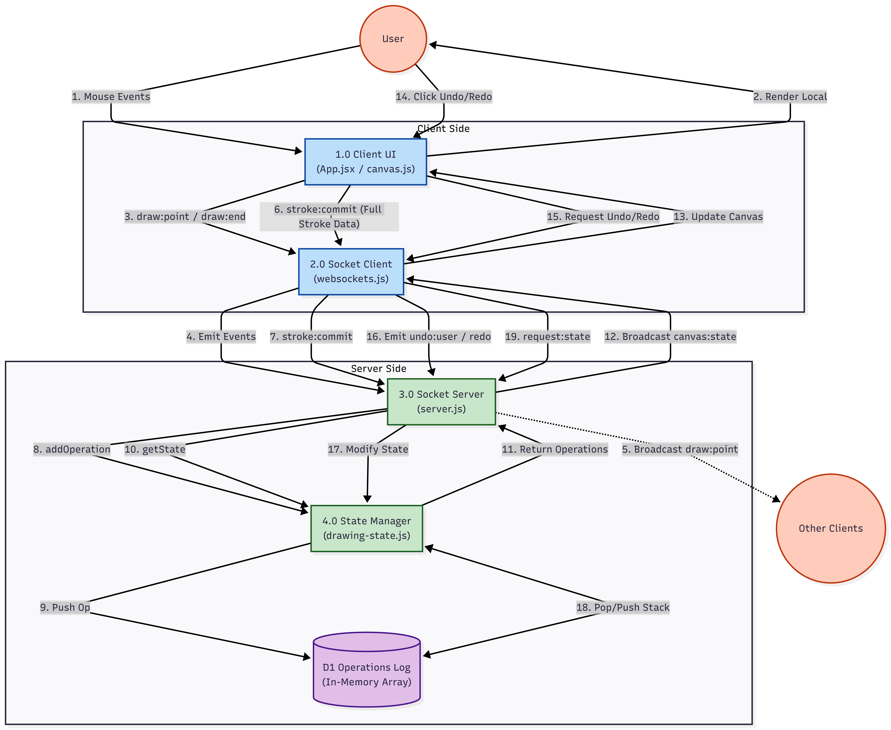

# 🧠 Architecture – Real-Time Collaborative Canvas

This document explains the **final deployed architecture** of the Real-Time Collaborative Drawing Canvas, including data flow, WebSocket protocol, undo/redo strategy, performance decisions, and conflict handling.

The system is designed to be **server-authoritative**, ensuring all users always see a consistent canvas state.

---

##  High-Level Architecture

```
Browser (Client A) ──┐
Browser (Client B) ──┼── WebSocket (Socket.io) ── Node.js Server ── Drawing State
Browser (Client C) ──┘
```

- Clients render drawings locally using the HTML Canvas API
- Server maintains the **single source of truth**
- All undo/redo actions are resolved on the server

---
## 📊 Data Flow Diagram


---

## 🔄 Data Flow (Live Drawing)

### 1. Stroke Start
- Client generates a unique `strokeId`
- Sends initial point with stroke metadata

```json
{
  "strokeId": "uuid",
  "x": 120,
  "y": 240,
  "color": "#ffffff",
  "width": 2,
  "tool": "brush"
}
```

### 2. Stroke Progress
- Client streams points in real time
- Other clients render immediately

```json
{
  "strokeId": "uuid",
  "x": 124,
  "y": 245
}
```

### 3. Stroke End
- Client commits full stroke to server

```json
{
  "id": "uuid",
  "color": "#ffffff",
  "width": 2,
  "tool": "brush",
  "points": [{ "x": 120, "y": 240 }, ...]
}
```

---

## 🌐 WebSocket Protocol

### Client → Server Events

| Event | Purpose |
|------|--------|
| `draw:point` | Stream live stroke points |
| `draw:end` | Mark end of stroke |
| `stroke:commit` | Persist stroke globally |
| `undo:user` | Undo last stroke by user |
| `undo:global` | Undo last global stroke |
| `redo` | Redo last undone stroke |
| `cursor:move` | Broadcast cursor position |
| `request:state` | Request full canvas state |

---

### Server → Client Events

| Event | Purpose |
|------|--------|
| `draw:point` | Broadcast live drawing |
| `draw:end` | End remote stroke |
| `canvas:state` | Full authoritative canvas state |
| `cursor:update` | Cursor movement updates |

---

## 🔄 Undo / Redo Strategy 

### Server-Side State

The server maintains:
- `operations[]` → list of committed strokes
- `undoStack[]`
- `redoStack[]`

Each operation includes:
```js
{
  id,
  userId,
  type: "stroke",
  data
}
```

### Undo Flow

1. User triggers undo
2. Server modifies operation history
3. Server emits updated canvas state
4. All clients redraw from scratch

✔ Ensures **perfect synchronization**  
✔ Allows undoing other users’ drawings

---

## 🎨 Canvas Redraw Strategy

- Canvas is **cleared and redrawn** from operation history
- Avoids pixel-level diffs (simpler & safer)
- Fast enough due to optimized stroke storage

---

## 🖱️ Cursor Synchronization

- Cursor positions are **not persisted**
- Sent via throttled WebSocket events
- Each cursor:
  - Assigned unique color (hash of socket ID)
  - Automatically removed after inactivity for 3 seconds

---

## ⚡ Performance Decisions

### Throttling
- Cursor updates throttled to ~25 FPS
- Prevents network flooding

### Minimal Payloads
- Live drawing sends only `(x, y, strokeId)`
- Metadata sent once per stroke

### Client-Side Prediction
- Local drawing happens instantly
- Network updates only synchronize others

---

## ⚔️ Conflict Handling

- No locking mechanism
- Multiple users can draw on same area
- Strokes are applied in arrival order
- Undo respects chronological order

This mirrors behavior of tools like Figma or Excalidraw.

---

## 🧩 Deployment Architecture

### Frontend
- Hosted on **Vercel**
- Uses environment variable:
```env
VITE_SOCKET_URL=https://livecanvas-production.up.railway.app
```

### Backend
- Hosted on **Railway**
- CORS restricted to deployed frontend domains
- WebSocket transport preferred

---

## 🚧 Known Limitations

- In-memory state (no persistence)
- Single canvas (no rooms)
- No authentication
- Canvas resets on server restart

---

## 🎯 Design Philosophy

- Prefer correctness over micro-optimizations
- Server-authoritative > peer-to-peer
- Simple data models for debuggability
- Every feature explainable in interviews

---

## ✅ Why This Architecture Works

- Deterministic canvas state
- Easy global undo/redo
- Scales conceptually with rooms/sharding
- Interview-friendly and production-realistic

---

**Author:** 
Anubhav Krishna  
